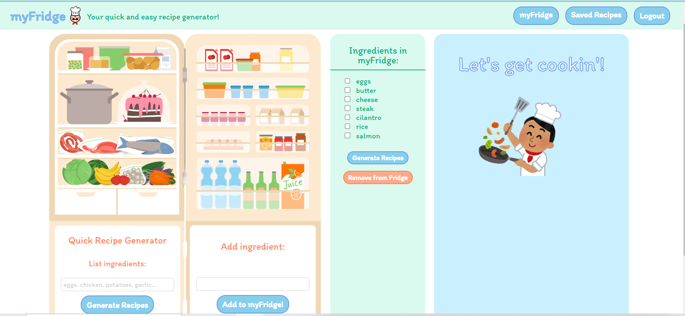

# Welcome to myFridge!

Feel free to check out our live site! [Live Site Link](https://myfridge-tkk4.onrender.com/)

# Background

myFridge is an original web app designed for when you cannot decide what to cook!  Once logged in you can add ingredients to your very own virtual fridge!  From this fridge, you can select the ingredients you would like to use and with the click of a button generate three unique recipes that use the selected ingredients.  If you like a recipe, you can then save the recipe to refer back to in the future.  If you thought of any way to improve upon one of your saved recipes, you can also add a note to each saved recipe.

# Functionality & MVPs
myFridge comes with 5 core features:

1. Hosting on Render.com
    - Visit [myFridge](https://myfridge-tkk4.onrender.com/) for a live demo

2. User Authentication & Demo User Account
    - Users can create their own account, login to an existing account, or use a demo user login
    

3. Personal Fridge With Ingredients
    - Users can add and delete ingredients to there fridge
    

4. Recipe Generator 
    - Users can generate 3 unique recipes that use ingredients given by the user
    - Users can generate 3 unique recipes that use ingredients selected from the users fridge
    - Users can generate 3 unique recipes that use random ingredients 
    

5. Saved Recipes
    - Users can save recipes to their profile and view them on their saved recipe page.
    - Users can also leave themselves a note on each of their saved recipes.
    

# Technologies, Libraries, APIs

- Languages: JavaScript, HTML, and CSS
- Frontend: React and Redux
- Backend: Express, Node.js
- Database: MongoDB
- Hosting: Render
- APIs: ChatGPT

# Developers
- Nicholas Hein, Hanna Darwish, Mathew Montejo, Nick Gentry
